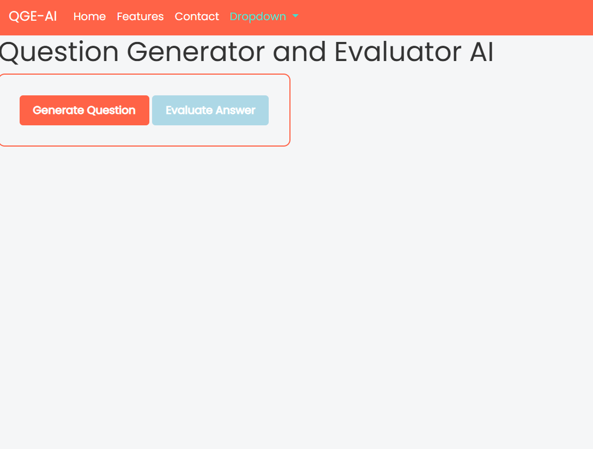
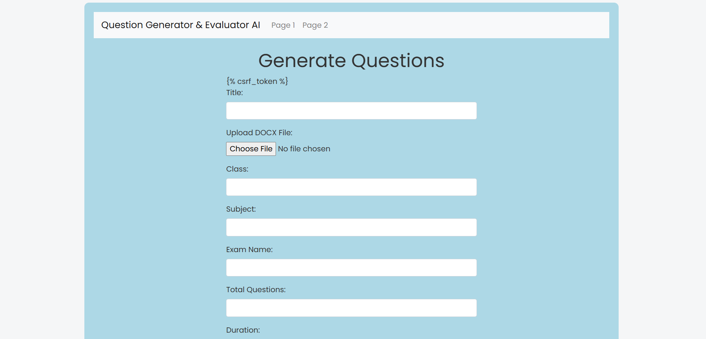
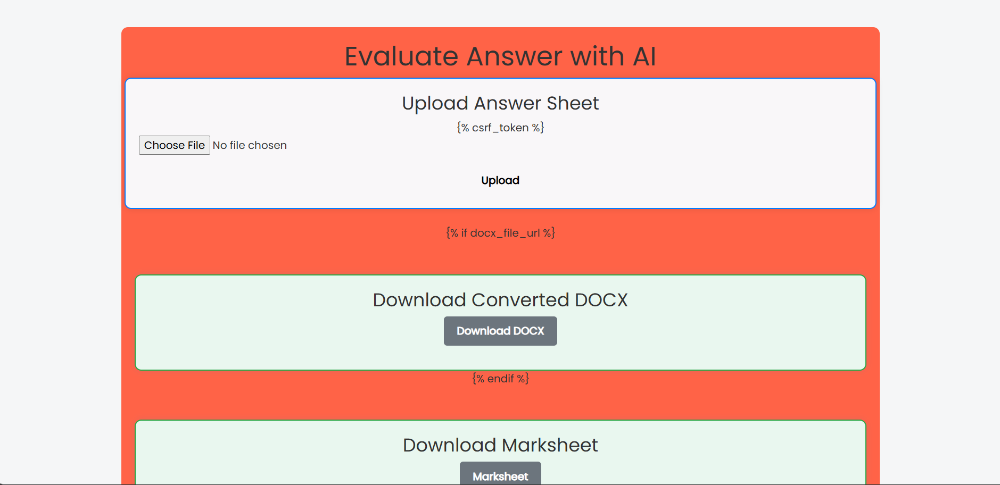

# SmartExaminer 🧠📝

SmartExaminer is a Django-based AI-driven exam assistant that automates the question paper generation and answer evaluation process. It helps teachers, educators, and students to create questions from uploaded documents and evaluate answers by generating marksheets — all from a single web interface.

## 🔧 Folder Structure

```
SmartExaminer/
├── Q_gen/                # Core logic for question generation
├── generated_docs/       # Folder to store generated questions, answers, and marksheets
├── media/                # Uploaded files (e.g., PDFs)
├── myproject/            # Django project settings and configuration
├── templates/            # HTML templates for frontend rendering
├── marksheet-docx/       # Word (.docx) files of generated marksheets
├── db.sqlite3            # SQLite database
├── manage.py             # Django management script
├── .gitignore            # Files/folders to ignore in Git
├── LICENSE               # MIT License
└── README.md             # This documentation file
```

## 🚀 Features

- 📄 Upload any book, article, or content file.
- 🤖 AI-based **Question Generator** from the uploaded document.
- 📝 Upload answers as PDF to **evaluate automatically**.
- 📊 View **marksheet with detailed scores** and download as DOCX.
- 🎓 Ideal for schools, coaching centers, and exam preparation tools.

## 🖼️ Screenshots

> (Add your screenshots below by placing image files in the repo)




```

## 💻 Technology Stack

- **Backend**: Django (Python)
- **Frontend**: HTML, Bootstrap
- **AI/ML**: Hugging Face Transformers (for question generation and evaluation)
- **Storage**: SQLite, DOCX generation
- **Tools**: PyMuPDF, python-docx, pdf2docx

## ⚙️ Setup Instructions

1. **Clone the Repository**
   ```bash
   git clone https://github.com/mmpbrother94/SmartExaminer.git
   cd SmartExaminer
   ```

2. **Create and Activate Virtual Environment**
   ```bash
   python -m venv venv
   venv\Scripts\activate      # For Windows
   source venv/bin/activate  # For macOS/Linux
   ```

3. **Install Dependencies**
   ```bash
   pip install -r requirements.txt
   ```

4. **Run the Django Server**
   ```bash
   python manage.py runserver
   ```

5. Open in browser:  
   `http://127.0.0.1:8000/`

## 🧠 Use Case

Perfect for:
- Teachers to create tests from study material
- Institutes automating evaluations
- Students preparing through self-evaluation
- AI-based document understanding projects

## 📃 License

This project is licensed under the [MIT License](LICENSE)

## 🙋‍♂️ Author

**Manohar Kumar**  
Built with guidance and mentorship of **Satya Sir**

> Let's revolutionize the education system through automation and intelligence 🚀  
